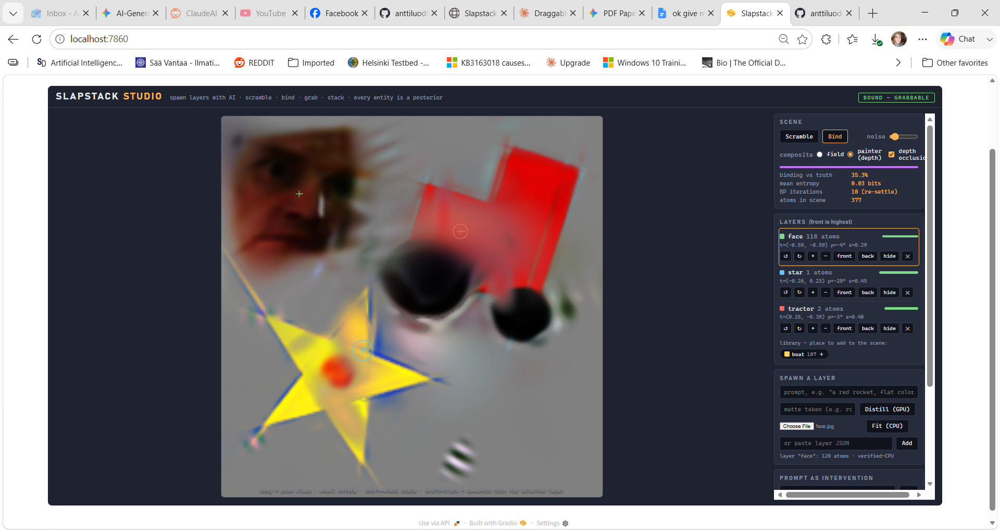

# Slapstack Studio (Bet 8 Playroom)

Live at huggingface: https://huggingface.co/spaces/Aluode/SlapStackStudio



An interactive, layered visual sandbox running multi-object Belief Propagation (BP) over Gabor packet representations. The system supports full 2D depth occlusion matting, spatial grab/drag/scale/rotate mechanics, semantic prompt interventions, and server-side neural layer distillation via Score Distillation Sampling (SDS).

## Architecture & Division of Labor

- **The Server (Python):** Handles visual generation and heavy pixel-to-atom fitting. It uses an SDS pipeline with Stable Diffusion 2.1 or deterministic MSE optimization to turn pictures/prompts into compact, normalized Gabor-atom templates.
- **The Client (Browser JS):** Runs a highly optimized, loopy Belief Propagation factor graph entirely client-side. The frontend manages pose clustering, tracks identities through deep occlusion, calculates real-time alpha masks, and translates user gestures into exact group-algebra conditioning updates.

---

## File Structure

```text
slapstack-bet8/
├── app.py                # HuggingFace Space / Gradio server entry point
├── oracle.py             # Image-to-atom fit & text-to-atom SDS generation paths
├── bet5_gabor_sds.py     # Underlying Gabor Packet model & differentiable renderer
├── requirements.txt      # Python dependencies for GPU/CPU runtimes
│
├── studio/               # Static folder mounted by FastAPI
│   ├── studio.html       # Single-file production client (fully built)
│   └── builtins.json     # Pre-trained compact templates (tractor, star, boat)
│
├── studio_ui.html        # Raw source markup for the client layout
├── studio_core.js        # Real-time alpha-matting & painter compositor logic
├── build.js              # Assembly script (combines UI + core logic into studio.html)
└── tests_studio.js       # Headless test suite validating depth occlusion math
```

## Getting Started

### Prerequisites

Make sure your environment has Python 3.10+ installed. For neural text-to-layer distillation, a CUDA-capable GPU is highly recommended.

### Installation

1. Clone or download the repository directory.
2. Install the necessary dependencies directly via pip:

```bash
pip install -r requirements.txt
```

### Running the App Locally

Launch the Gradio server by executing:

```bash
python app.py
```

Open your browser and navigate to http://127.0.0.1:7860. The unified workspace will load instantly without requiring any building or file compilation.

## Feature Overview & Control Guide

### Interactive Canvas

- **Scramble:** Randomizes object poses to throw all atoms into an unassigned "soup."
- **Bind:** Runs loopy BP live in the browser. You can watch the atoms settle, crystallize into boundaries, and snap back to their matching identity profiles.
- **Mouse Controls (Grabbable Posterior):**
  - Click + Drag any recognized object to clamp its position. The environment dynamically re-settles around it.
  - Mouse Wheel rotates the targeted object about its calculated center.
  - Shift + Mouse Wheel scales the targeted object up or down.

### Layer Manipulation & Occlusion Semantics

- Switch the scene blend setting from **Field** (additive summation) to **Painter** to observe full alpha-compositing across individual depths.
- Moving an object entirely behind another activates **Depth Occlusion**. Covered atoms cleanly release their assignments and revert back toward a state of uniform uncertainty (their marginal prior), while the shape's pose boundary coasts seamlessly behind the obstruction. Moving the object away re-establishes evidence and triggers immediate re-binding.

### Spawning Custom Layers

- **Fit (CPU):** Upload any image containing a subject on a neutral, solid gray background. The optimizer will spend its entire atom budget crafting a tight, isolated layer template.
- **Distill (GPU):** Enter a descriptive text prompt to distill an atom map from Stable Diffusion.
  - *Note for Local Deployment:* The system is pre-configured to look for `sd2-community/stable-diffusion-2-1-base` to efficiently reuse local caches located under `~/.cache/huggingface/hub/`.

### Prompt Interventions

Enter clean, natural commands in the prompt box (e.g., *"move the boat left, send the star behind the tractor"*) to execute hard algebraic transformations. The graph instantly recalculates the new joint posterior distribution around your action.
